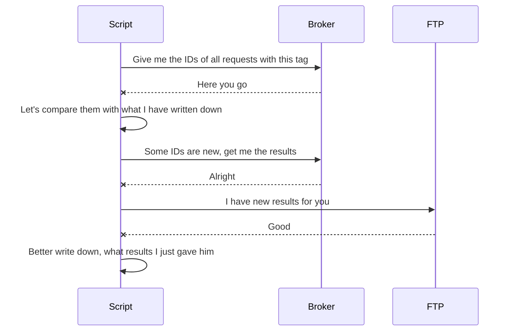

# broker-sftp-interface 
Simple script that filters all [AKTIN Broker](https://github.com/aktin/broker) requests by a given tag and uploads the results of the filtered requests to a specified FTP server.

Remembers the uploaded results via a created XML file that stores the request ID and the completeness of the uploaded results. Matches the completeness of broker requests with the XML file before uploading to the FTP server and uploads only new/changed results.

## Testing

For testing the script, **test.py** is attached. To run the test script, a running instance of the AKTIN broker-server is needed. Preferably via the [broker-admin-dist](https://github.com/aktin/broker/tree/master/broker-admin-dist) package, but [broker-docker](https://github.com/aktin/broker/tree/master/docker) should work as well.

Prior testing, broker requests are needed to be created on the broker-server. The content of the requests is irrelevant, it is only important that a tag is set for each request. The easiest way to create broker requests is to use the view of the broker-server. The default credentials are as following:

	url: http://localhost:8080/admin/html/login.html
	user: admin
	password: CHANGME

Furthermore, a running instance of an FTP server is required. During development [bogem/ftp](https://hub.docker.com/r/bogem/ftp) was used.

Finally, enter the information about the broker and the FTP server in  **ftp_export.py**

    BROKER_URL = 'localhost:8080'
    ADMIN_API_KEY = 'xxxAdmin1234'

    FTP_IP = '127.0.0.1'
    FTP_PORT = 21
    FTP_USERNAME = 'username'
    FTP_PASSWORD = 'password'

## Setup SFTP Server Ubuntu
sudo apt install openssh-server ssh

sudo addgroup sftp
sudo useradd -m sftpuser -g sftp
sudo passwd sftpuser

sudo mkdir -p /var/sftp/rki
sudo chown root:root /var/sftp
sudo chmod 755 /var/sftp
sudo chown ftpuser:sftp /var/sftp/rki

sudo nano /etc/ssh/sshd_config

Port 22
Match User sftpuser
ForceCommand internal-sftp
PasswordAuthentication yes
ChrootDirectory /var/sftp
PermitTunnel no
AllowAgentForwarding no
AllowTcpForwarding no
X11Forwarding no

service ssh restart

"""
import paramiko

transport = paramiko.Transport(('192.168.56.1', 22))

transport.set_keepalive(60)

transport.connect(username = 'ftpuser', password = 'ftpuser')

sftp = paramiko.SFTPClient.from_transport(transport)

sftp.put('status.xml', 'rki/status.xml')
"""

# TODO
create Fernet-Key

https://github.com/fernet/spec/blob/master/Spec.md

# init integration environment
create docker for aktin broker
create docker for aktin client (x2) ??
create docker for sftp server
create docker for python script

# check initialization
get from broker connected clients
create 5 requests for client, 3 with tag test
client accept one request

check created requests on broker
check recieved requests from client

check if sftp server is online

# run integration test
run python script

status xml should have 3 entries
sftp should have 3 files
sftp should have status xml

broker create on additional request for client
client accept two request

run python script

status xml should have 2 updates and 1 new
sftp should have 4 files
sftp should have status xml

broker delete 2 requests

run python script

status xml should have 2 deleted tags
sftp should have 2 files
sftp should have status xml

# close integration environment
close aktin broker
close aktin client
close sftp server
close python docker

# github server basierte workflows

# aktin cli modus
