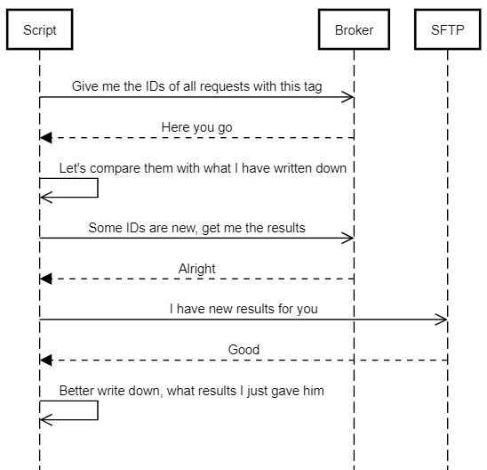

# broker-sftp-interface [](https://sonarcloud.io/dashboard?id=aktin_broker-sftp-interface) 

Simple script that filters all [AKTIN Broker](https://github.com/aktin/broker) requests by a given tag and uploads the results of the filtered requests to a specified SFTP server.

Remembers the uploaded results via a created XML file that stores the request ID and the completeness of the uploaded results. Every time a result is uploaded to the SFTP server the corresponding file is noted in a seperate xml file (default name: status.xml). Each node named `request-status` corresponds to one uploaded result. If an uploaded result is updated or deleted, a tag with the timestamp of the file operation is added to the corresponding node, for example `<last-update>2021-10-11 09:39:56</last-update>` or `<deleted>2021-10-11 09:39:55</deleted>`. The date format of all timestamps is `UTC`.

```
<request-status>
    <id>2</id>
    <completion>0.5</completion>
    <uploaded>2021-10-11 09:39:50</uploaded>
</request-status>
```

The completeness of broker requests are matched with the ones saved in the XML file prior uploading to the SFTP server. Only new/changed results are uploaded. All uploaded files are symmetrically encrypted using [Fernet](https://github.com/fernet/spec/blob/master/Spec.md). If a broker request is deleted, the corresponding result is also deleted from the SFTP server.



## Testing

To test the script, **integration-test.bat** and **integration-test.sh** are attached. To run an integration test, a running instance of [Docker](https://www.docker.com/) is needed. The script will create multiple container to simulate the [AKTIN Broker Server](https://github.com/aktin/broker/tree/master/broker-server), two [AKTIN Broker Clients](https://github.com/aktin/broker/tree/master/broker-client) as well as an basic SFTP Server using [OpenSSH](https://www.openssh.com/). For the integration tests, the default configuration of **sftp_export.py** must be used.

During integration testing, the AKTIN broker creates several requests that are retrieved and completed by the AKTIN clients. The **sftp_export.py** script is executed in between to detect changes in the completeness of the created requests. 

While an integration-test script is running, the console displays the currently executed step. If a step goes wrong or the expected result is not returned, it is marked in the console accordingly with a red font. The script itself is not aborted and therefore requires a manual check for correctness.

## Usage
To use this script in your environment, you need to configure some variables. The script is only usable with a **broker-server >= 1.3.3**, as the tagging feature was only added in V1.3.3. 

Furthermore, a Fernet key is required for symmetric encryption. It is currently not possible to disable encryption in this script. A local key can be created in Python with the following command: 

```
from cryptography.fernet import Fernet
with open('rki.key', 'wb') as key:
    key.write(Fernet.generate_key())
```

Access to the SFTP server is only possible via a username-password combination. Authentication via an SSH key is currently not implemented.


| Parameter  | Description | Example |
| ------------- | ------------- | ------------- |
| BROKER_URL | Url to your broker server | http://localhost:8080 |
| ADMIN_API_LEY | Admin api key of your broker server | xxxAdmin1234 |
| TAG_REQUESTS | Tag to filter requests on your broker server by | rki |
| SFTP_HOST | IP adress of your sftp server | 127.0.0.1 |
| SFTP_USERNAME | Your user on your sftp server | sftpuser |
| SFTP_PASSWORD | Password of your sftp user | sftppassword |
| SFTP_FOLDERNAME | Folder in sftp root directory to store files in | rki |
| PATH_KEY_ENCRYPTION | path to fernet key for symmetric file encryption | folder/rki.key |
